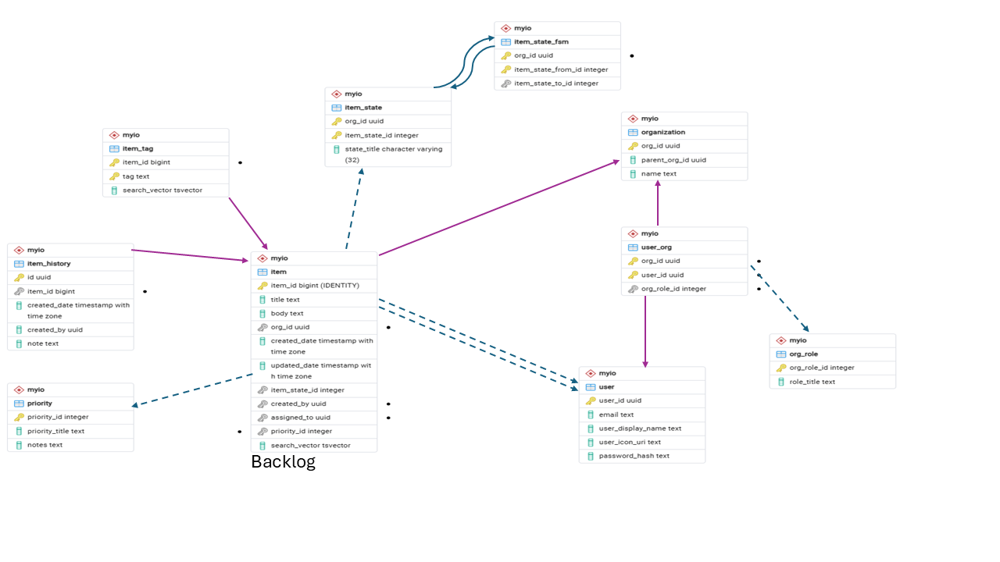

# Schema

## Tables

| Table | Purpose |
| :--- | :--- |
| Item | This is the main backlog |
| User | Users |
| Orginization | Orgs |
| User_Org | What role does a user have in an org? Default: None |
| user_org_role | Role from 0 none to 8 all powerful |
| priority | mix of ITIL and AppDev all in one (use item.rank to sort inside each priority) |
| Item_State | What state is the item in? (per org) |
| Item_State_FSM | Given the current state what state could it go into? |
| Item_History | History, Change Log, Notes all-in-one |
| Item_Tag | Tag Cloud (tags are DIY) |